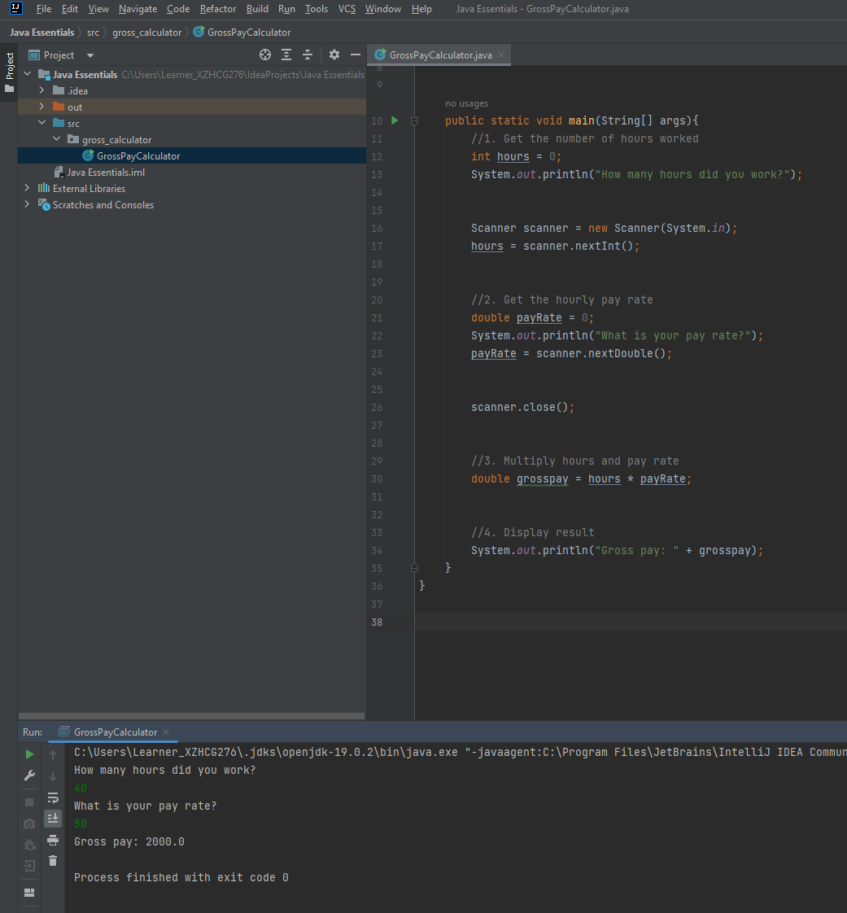

# Instructions for creating a Gross Pay Calculator in Java:


#### Step 1: Open your preferred Java IDE (Integrated Development Environment) and create a new Java project.

#### Step 2: Create a new Java class named "GrossPayCalculator".

#### Step 3: Inside the "GrossPayCalculator" class, create the "main" method, which is the entry point of the program. The "main" method should have the following signature:

```
public static void main(String[] args) {
    // code goes here
}
```
#### Step 4: Use the "Scanner" class to read input from the console. Create a new instance of the "Scanner" class using the following line of code:

```
Scanner scanner = new Scanner(System.in);
```
#### Step 5: Use the "System.out.println()" method to print a prompt to the console asking the user to enter the number of hours worked. Use the "scanner.nextInt()" method to read the input and store it in a variable named "hours". The following code reads the number of hours worked:

```
int hours = 0;
System.out.println("How many hours did you work?");
hours = scanner.nextInt();
```
#### Step 6: Print a prompt to the console asking the user to enter the hourly pay rate. Use the "scanner.nextDouble()" method to read the input and store it in a variable named "payRate". The following code reads the hourly pay rate:

```
double payRate = 0;
System.out.println("What is your pay rate?");
payRate = scanner.nextDouble();
```
#### Step 7: Calculate the gross pay by multiplying the number of hours worked by the hourly pay rate. Store the result in a variable named "grosspay". The following code calculates the gross pay:

```
double grosspay = hours * payRate;
```
#### Step 8: Use the "System.out.println()" method to print the gross pay to the console. The following code prints the gross pay:

```
System.out.println("Gross pay: " + grosspay);
```
#### Step 9: Add error handling to catch any exceptions that are thrown when trying to read input from the console. Use a try-catch block to catch the InputMismatchException that is thrown if the user enters non-numeric input. If an exception is caught, print an error message to the console and terminate the program. The following code adds error handling:

```
try {
    // code for reading input and calculating gross pay
} catch (InputMismatchException e) {
    System.out.println("Invalid input. Please enter a valid number.");
}
```
#### Step 10: Save and run your program. The program should ask the user to enter the number of hours worked and the hourly pay rate, calculate the gross pay, and print the result to the console. If the user enters non-numeric input, an error message should be displayed.

## Screenshot

